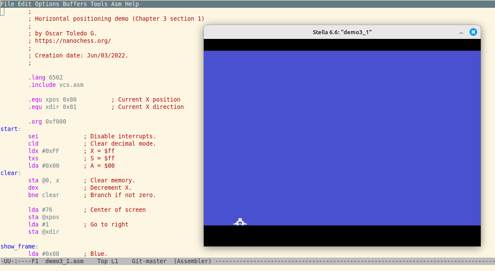
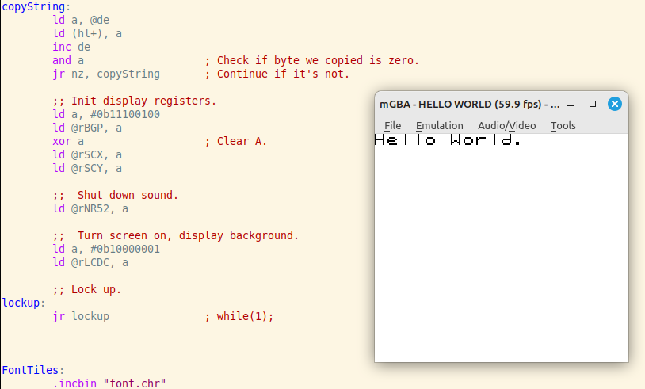
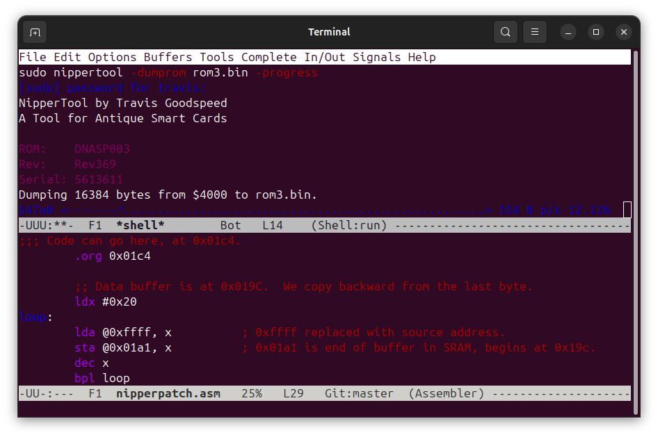
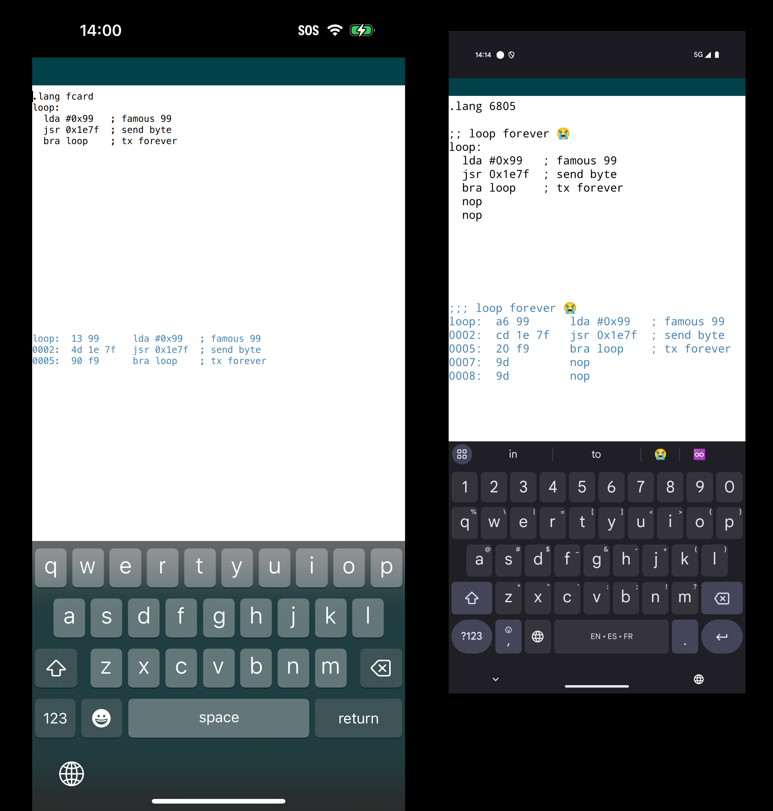

Howdy y'all,

These days, the world has many excellent disassemblers, but when
writing assembly in a weird languages, many of us just fall back to
handwriting bytes in Nasm or painfully adjusting to yet another macro
assembler.  GoodASM is my attempt to fix that.

This assembler is very easy to retarget by extending C++ class and
calling a few functions.  You pretty much just define the endianness
and byte size, then copy the instruction definitions almost verbatim
from the programmer's guide.

Defining a new target is completely symmetric.  While assembly is the
primary purpose of this tool, a disassembler is also produced.  An
example for each instruction automatically becomes a unit test,
insuring that you don't accidentally fat-finger a bitfield or two.

When writing assembly, particularly shellcode, you often have
questions that a calculator should answer.  What are all the
instruction that begin with `ro` in this language?  What are all of
the potential forms of the `jmp` instruction?  Does `ror a` assemble
to ASCII?  An interactive REPL mode answers these in a jiffy, with tab
completion.

If you like this program, please buy my book on [Microcontroller
Exploits](https://www.amazon.com/Microcontroller-Exploits-Travis-Goodspeed/dp/1718503881)
for yourself or for a clever student.

--Travis


## Status

Some critical features remain to be written before a public release,
but enough features are supported for 6502 and the GameBoy to write
real programs.  See the [Issue
Tracker](https://github.com/travisgoodspeed/goodasm/issues) for known
bugs and missing features.

A language is `alpha` if it is relatively unused, `beta` if successful
test programs have been written for it, and `stable` if it has been
used for real projects and compared against competing assemblers for
accuracy.  `partial` languages are not yet complete, and you should
check the issue tracker for their status.

Source code and binaries will be publicly released at
[DistrictCon](https://www.districtcon.org/) on Feb 21, 2025.

## Building

For GUI development, install the [Qt Dev Kit]() and then open
`CMakefile.txt` in Qt Creator.

To build in Linux without the GUI, first install `qt6-declarative-dev`, `qml6-module-\*`
and `cmake`, then run the following:
```
git clone https://github.com/travisgoodspeed/goodasm
cd goodasm
mkdir build
cd build
cmake ..
make -j 8 clean all
```

The preferred executable is `goodasm`.  The GUI for iOS and Android is
more of a fun toy than a tool.

## Examples



`tests/6502/nanochess` contains translations of the first few
chapters of [Programming Games for Atari
2600](https://www.amazon.com/Programming-Games-Atari-Toledo-Gutierrez/dp/1387809962/)
by Oscar Toledo G.  Hashes are compared to make sure that our
assembler produces the same binaries as Oscar's, and pull requests are
waiting if you convert any of the remaining demos from that book into
this assembler's style.



`tests/sm83/hello.asm` is a simple Hello World for the SM83
architecture of the Nintendo Game Boy.



`tests/6805/nipperpatch.asm` is the 6805 shellcode from my
[NipperTool](https://github.com/travisgoodspeed/nippertool/) exploit
for the Nagra ROM3 cards that Dish Network used twenty-five years ago.
In NipperTool, this code is exported as Go source code with a map of
symbol names, so that the tool can patch the target address being
dumped by the shellcode.

## Using the Disassembler

Running `goodasm --help` will show the command line arguments,
supported languages and other features.

```
air% goodasm --help
Usage: goodasm [options] input
GoodASM is an easily retargetable assembler for CISC microcontrollers.

Options:
  -h, --help                Displays help on commandline options.
  --help-all                Displays help, including generic Qt options.
  -v, --version             Displays version information.
  -V, --verbose             Talk too much.
  --cheat                   Print a cheat sheet of mnemonics.
  --opcodetable             Print a table of opcodes.
  -t, --test                Selftest the selected language.
  --fuzz                    Fuzz test to find crashes.
  -g, --grade               Is this binary in the chosen language?
  -d, --dis                 Disassemble a binary input.
  --base <base>             Base address of an input binary.
  -o, --export <file>       Output filename.
  -S, --symboltable <file>  Export symbol table
  --repl                    Interactive shell.
  --wait                    Wait after cleanup.
  -L, --list                Print a listing to stdout.
  -H, --hex                 Print hex of output to stdout.
  -N, --nasm                Output is legal in NASM.
  -C                        Output is legal in C.
  -G, --golang              Output is legal in Golang.
  -Y, --yara-x              Output is legal in Yara-X.
  -M, --markdown            Output is legal in Markdown.
  -b, --bytes               List bytes in output.
  -B, --bits                List bits in output.
  -A, --auto                Comment with cheat sheet when available.
  -a, --adr                 List addresses in output.
  --8086                    Intel 8086 (broken)
  --6502                    MOS 6502 (stable)
  --6805                    68HC05 (stable)
  --fcard                   68HC05SC21 DSS P1 F-Card (stable)
  --sm83, --gb              Sharp SM83 / Gameboy (stable)
  --z80                     Zilog Z80 (stable)
  --tlcs47                  Toshiba TLCS47 (alpha)
  --8051                    Intel 8051 (alpha)
  --ucom43                  Sharp UCOM43 (alpha)
  --s2000, --emz1001        AMI S2000 / Iskra EMZ1001 (alpha)
  --pic16c5x                PIC16C5x (12-bit) (alpha)
  --marc4                   Atmel MARC4 (alpha)
  --chip8                   Chip-8 (broken)

Arguments:
  input                     ROM image to decode or source to assemble.
```

Let's begin with the `guesses` test file for AMI's S2000 architecture,
an assembly language I expect you've never heard of.  Its biggest
claim to fame is that it was also called EMZ1001, Yugoslavia's only
locally manufactured microcontroller.

By default, GoodASM has no language defined, so it will just output
`db` directives.

```
% goodasm -da guesses 
0x00: 	db 0x00
0x01: 	db 0x01
0x02: 	db 0x02
0x03: 	db 0x03
0x04: 	db 0x6f
0x05: 	db 0xcf
```

We can get a more useful listing by specifying the language with
`--s2000`.  Of the single letter parameters, `d` disassembles, `b`
prints the bytes within the disassembly, `a` includes the address of
each instruction, and `A` auto-comments with the help entry of each
instruction.

```
% goodasm -dbaA --s2000 guesses
0000:   00      nop                       ; No operation.
0001:   01      brk                       ; Break.
0002:   02      rt                        ; Return from subroutine.
0003:   03      rts                       ; Return from subroutine and skip next instruction.
0004:   6f      pp #0x000f                ; Prepare page or bank register.
0005:   cf      jmp #0x000f               ; Jump to immediate in prepared page and bank.
```

You can also use the interactive mode to type in bytes for
disassembly.  This is useful when writing shellcode by hand or working
out errors in a damaged disassembly.

```
carbon% goodasm -dba --s2000 --repl
goodasm> 00 01 02 03 6f cf
0000:   00      nop                       
0001:   01      brk                       
0002:   02      rt                        
0003:   03      rts                       
0004:   6f      pp #0x000f                
0005:   cf      jmp #0x000f               
goodasm> 6fcf
0000:   6f      pp #0x000f                
0001:   cf      jmp #0x000f               
goodasm> 
```


## Using the Assembler

The assembler functions from the exact same definitions as the
disassembler, so there is no language that works with one but not the
other.

Use the `-H` parameter to dump the output as text or `-o` as a binary
file.  `-L` prints an instruction listing, matching source code to the
binary.  The same language flags work as in the disassembler, but you
can also use the `.lang` directive to specify it within your source
file.

```
% cat undefined.asm
	.lang 6502
	nop			; Do nothing.
	brk			; 1-byte in documentation,
	nop			; but we follow with padding.
% goodasm -H undefined.asm -o undefined.bin
ea 00 ea
% goodasm -Lba undefined.asm 
0000:   ea         nop                    ; Do nothing.
0001:   00         brk                    ; 1-byte in docs.
0002:   ea         nop                    ; but we follow with padding.
```

Just like in disassembly, you can use the interactive mode to try out
instructions.  Tab completion will give you verb names and parameters.

```
% goodasm --6502 
goodasm> st<TAB>
sta  stx  sty  
goodasm> stx <TAB>
stx @0xdead
stx @0x35
stx @0x35, y
goodasm> stx @0xdead
[0] 8e ad de 
goodasm> 
```

Because every assembly language is unique, and it's a devil to
remember all the forms of a new one, a handy cheat sheet from the
instruction text cases will remind you of the available instructions.

```
% goodasm --6502 --cheat
adc #0xff           ;; Add to A with Carry. (immediate)
adc @0xdead         ;; Add to A with Carry. (absolute)
adc @0xdead, x      ;; Add to A with Carry. (X-indexed absolute)
adc @0xdead, y      ;; Add to A with Carry. (Y-indexed absolute)
adc @0x35           ;; Add to A with Carry. (zero-page)
adc @0x35, x        ;; Add to A with Carry. (X-indexed zero-page)
adc (@0x35, x)      ;; Add to A with Carry. (X-Indexed Zero Page Indirect)
adc (@0x35), y      ;; Add to A with Carry. (Zero Page Indirect Y-Indexed)
...
```

The rules of syntax will differ a bit from other languages, but
generally it works like this:
1. `#` begins an immediate value, a literal constant.
2. Only code address targets are used without a prefix, as in `call` or `jmp`.
3. `@` begins an absolute value, referring to the value at the address.
4. `()` are grouping symbols, usually referring to the value at the address within the group.
5. `,` separates parameters within a group.
6. Integers begin as `0x` for hex, `0b` for binary.  Default is decimal.
7. A label is defined with a symbol name before a colon, or by `.equ`.
8. Labels needn't be defined on first usage, but they must be defined by the end.
9. Assembly passes continue until all symbols settle to consistent values.

A number of directives are available for all languages:
```
.org 0xff00          ;; First call sets the base address.
.org 0xff10          ;; Second call fills the binary until target adr.
.lang 6502           ;; Switch the language to 6502.
.include "foo.asm"   ;; Includes a sourceflie.
.incbin "foo.bin"    ;; Includes the bytes of a binary file.
.equ foo 0xcafe      ;; Defines the symbol foo to be 0xCAFE.
.db 0xde, 0xad, 0xbe ;; Includes the bytes DEADBE.
.db "hello", 0       ;; Null terminated string.
.ib 9d de ad be ef   ;; Instruction bytes, disassembled then reloaded.
```

Some are intended for interactive use in REPL mode.
```
.cheat               ;; Print the cheat sheet.
.symbols             ;; Print the symbol table.
```



A little less versatile than the REPL mode, we also support an
interactive mode for iOS and Android.  Please don't do real work this
way, but it's handy when studying an instruction set with pen and
paper, away from a real laptop.


## Defining a New Language

You can find instruction definitions in `galang8051.cpp`/`.h`.  Many
instructions are opcodes with no parameters, so they are defined as
just a name and an opcode byte.  `gamnem` is defined to be `new
GAMnemonic`, and it's a common design pattern to shorten definitions
like that when defining languages.

The simplest instruction is `nop`, which does nothing.  It has an
opcode of `00`. It is defined like this within the constructor of
`GALang8051`, along with a short help string and a shorter example.
The example doubles as a unit test, and `goodasm --8051 --test` will
fail if the examples do not properly assemble to their matching
mnemonics.

```
insert(mnem("nop", 1, "\x00", "\xff"))
  ->help("No operation.")
  ->example("nop");
```

The `swap` instruction with opcode `c4` is a little more complex,
taking the accumulator as an argument.  In this case, I first insert
my mnemonic and define its help and example strings, then I call
`regname()` to specify that the parameter must be `a`.  Note that this
defines both the machine language instruction `c4` and all the parsing
needed for the assembly language instruction `swap a`.

```
insert(mnem("swap", 1, "\xc4", "\xff"))
  ->help("Swap nybbles of the accumulator.")
  ->example("swap a")
  ->regname("a");
```

For instructions with common parameter types, we can quickly define
arguments.  You've already seen `regname()` which specifies exactly
one register of a particular name, but other common types include
`abs()` to specify the byte in memory at particular address, `imm()`
to specify an immediate value in bytes, `adr()` and `rel()` to specify
absolute and relative addresses, and others that are defined in
`gaparameter.h`.

Here's how the `pop` instruction is written in 8051, popping a byte
from the stack into memory at a specified address.  We might write
`pop @0xde` to pop one word from the stack into memory at `DE`; this
will assemble to `D0 DE`.

```
insert(mnem("pop", 2, "\xd0\x00", "\xff\x00"))
   ->help("Pop from stack to mem[adr].")
   ->example("pop @0xff")
   ->abs("\x00\xff");
```

Relative addressing is used for short jumps in many architectures.
The standard form assumes a signed relative offset from the program
counter, and you should always specify an constant offset.  This might
be zero, but on CISC chips like 8051 it's more likely the length of
the jump instruction, as the program counter has already advanced when
the jump occurs.

Here we define a short jump with a relative offset in its second byte,
plus a constant of 2 for the length of the instruction.  Other 8051
jump instructions are three bytes long, and they use 3 for the constant
offset in `rel()`.

```
insert(mnem("sjmp", 2, "\x80\x00", "\xff\x00"))
        ->help("Short Jump.")
        ->example("loop: sjmp loop")
        ->rel("\x00\xff", 2);
```

### Defining new Parameter Types

Sometimes you'll have a parameter that is totally unique to your chip,
and these must be defined from scratch.  Generally you need to define
a constructor that sets the mask, a `match()` method that determines
whether assembly code is matching, and `encode()`/`decode()` methods
to convert between machine language and assembly.  The parameter is
self-contained; it does not care about other parameters or the opcode.

Sticking with the 8051 example, that machine has short jumps and short
calls with an 11-bit address.  This address is not relative, but
rather overwrites the low 11 bits of the program counter, after the
program counter is incremented by the instruction size.

First, we make a new class that inherits from `GAParameter`,
overriding some important functions.

```
//Represents an 11-bit address offset on 8051
class GAParameter8051Addr11 : public GAParameter {
public:
    GAParameter8051Addr11(const char* mask);
    int match(GAParserOperand *op, int len) override;

    QString decode(GALanguage *lang, uint64_t adr,
                   const char *bytes, int inslen) override;
    void encode(GALanguage *lang,
                uint64_t adr, QByteArray &bytes,
                GAParserOperand op,
                int inslen
                ) override;
};
```

We don't want to keep re-implementing bit masking, so our methods here
will call `rawdecode()` or `rawencode()` to read or write the
appropriate bits of the instruction.  In encoding, the
`GAParserOperand` parameter provides the value as a string or a
decoded integer.

Here is how we encode this 11 bit address.

```
void GAParameter8051Addr11::encode(GALanguage *lang,
            uint64_t adr, QByteArray &bytes,
            GAParserOperand op,
            int inslen
            ){
    int64_t val=op.uint64(true);
    val-=2;       // PC+2 will be applied when the CPU decodes the instruction.
    val&=~0xf800; // Mask off upper bits, which are not encoded.

    rawencode(lang,adr,bytes,op,inslen,val);
}
```

Once the methods are in place, a preprocessor directive lets us easily
insert it into instructions.

```
//11 bit address field, kinda like an in-page branch.
#define addr11(x) insert(new GAParameter8051Addr11((x)))

insert(mnem("acall", 2, "\x11\x00", "\x1f\x00"))
  ->help("Calls a subroutine within 2kB.")
  ->example("loop: acall loop")
  ->addr11("\xe0\xff");
```


## Classes to Know

I've taken care to comment these classes.  Please read first the `.h`
and then the `.cpp` of any class that you intend to use.

`GALanguage` tracks an assembly language, and later, it might also be
used to track dialects.  By default, the language has no instructions,
and any unknown instructions will disassembler to a `db` directive for
a data byte.  `galang*.cpp` subclass this for specific languages by
adding `GAMnemonic` records for every supported instruction.

`GoodASM` tracks the project as a whole.  It is constructed around a
`GALanguage` instance, and many of the flags that you specify on the
CLI are implemented by public variables of this class, such as
`listadr`/`-a` and `listbytes`/`-b`.

`GAMnemonic` implements the abstract idea of an instruction, roughly
equivalent to one opcode in CISC.  These are loaded into a
`GALanguage` instance to teach it the individual opcodes, names, and
parameters.  Overlaps are resolved by setting priorities, and new
parameter types can be generated by class inheritance when your
particular language is a little strange.

`GAInstruction` implements a concrete instruction of a program, and
its `->next()` method can advance to the next instruction.  This
differs from `GAMnemonic`, whose job is to describe the generic
instruction and its parameters rather than a known sequence of bytes.
A `GAInstruction` might have come from a line of source code, or it
might have come from byte in a file.

`main.cpp` implements the CLI and all its parameters.  Until other
examples of using this as a library are added, this will be your best
source of examples for using the library.

`galexer.cpp` implements the low-level lexer, which feeds into
`gaparser.cpp` for parsing.  Parsing is very strictly shared by all
languages, so that someday the parser can be rewritten without
breaking code compatibility.


## Similar Assembler/Disassemblers

[Naken ASM](https://github.com/mikeakohn/naken_asm)

## Similar Assemblers

[Gasm80](https://github.com/nanochess/gasm80) and
[tinyasm](https://github.com/nanochess/tinyasm) by Oscar Toledo G,
from whose [Atari 2600
book](https://www.amazon.com/Programming-Games-Atari-Toledo-Gutierrez/dp/1387809962/)
many of the 6502 tests were built.

[dasm](https://github.com/dasm-assembler/dasm) the 8-bit Macro Assembler

[The Macroassembler AS](http://john.ccac.rwth-aachen.de:8000/as/)


## Similar Disassemblers

MAME's [Universal Disassembler](https://github.com/mamedev/mame/blob/master/src/tools/unidasm.cpp)

